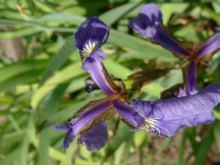
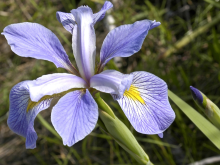
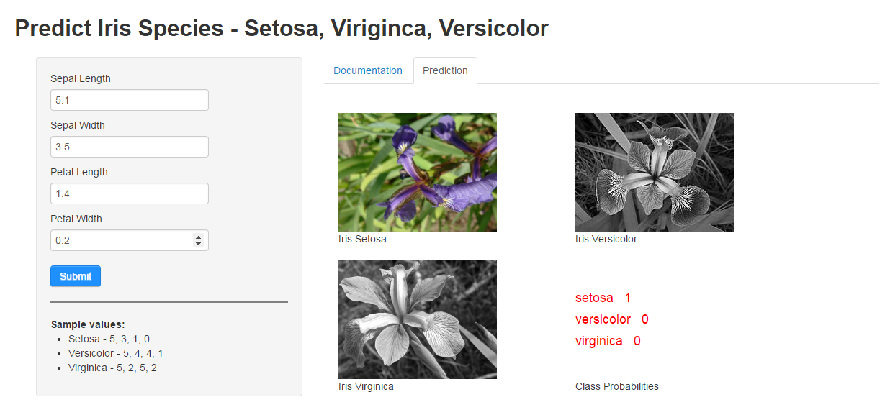

<style type="text/css">
  
  h1 
  {
    font-size: 72px !important; 
  }
  
  h3
  {
    font-size: 44px !important;
    //color: white !important;
    margin: 0px !important;
  }
  
  .slides > section:not(:first-child)
  {
    background-color: Lavender;
    padding: 30px 40px 30px 40px;
  }
  
  .slides > section:first-child > div > p
  {
    font-size: 40px;
    margin-top: 0px;
  }
  
  .slideContent:not(:first-child)
  {
    font-size: 28px;
    padding: 40px 0px 0px 0px;
    text-align: justify;
  }
  
</style>

Developing Data Products - Course Project
========================================================
author: kngv
date: 21 December 2014
transition: rotate

Predicting iris species






Application Description (1)
========================================================


This Shiny application utilizes the R iris dataset. The dataset contains 150 observations and 5 variables.

It predicts the **iris species** based on the following attributes:
- Sepal Length
- Sepal Width
- Petal Length
- Petal Width

Each prediction contains the probabilites that an observation belongs to a particular species. 
A sample prediction can be seen in the following slide.


Application Description (2)
========================================================
**Random forest** is used to train the model. All variables (except species) are used to predict the outcome.


```r
library(caret)
data(iris)

# Build model
modelfit <- train(Species~., method="rf", data=iris)

# Predict new observation
predict(modelfit, data.frame(Sepal.Length=5.1, 
                              Sepal.Width=3.5, 
                              Petal.Length=4.1, 
                              Petal.Width=1.2), type="prob")
```

```
  setosa versicolor virginica
1  0.028      0.952      0.02
```


Application Usage
========================================================
1. Input the predictor variables
  - Sepal Length
  - Sepal Width
  - Petal Length
  - Petal Width
* Click **Submit** button
* The class probabilities will be returned.
* The species with the highest probability will be selected. Otherwise, the rest shall remain unselected.


Application Screenshot
========================================================


The application can be found [here](https://kngv.shinyapps.io/DevDataProd_Project/).

